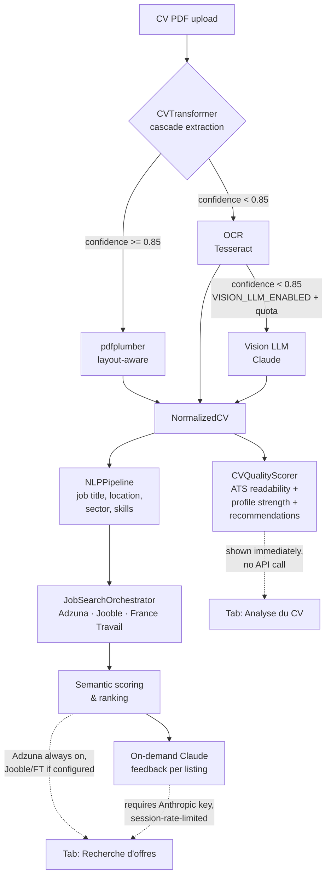

# ATS CV Scorer

Portfolio project — ML Engineer track.

🔗 **Live demo**: [voroman/ats-cv-scorer](https://huggingface.co/spaces/voroman/ats-cv-scorer)

Upload your CV (PDF) only. The pipeline extracts your **job title**,
**skills**, **location** and **sector**, runs an immediate **CV quality
report** (ATS readability + profile strength + prioritized
recommendations), then automatically searches matching job listings across
**multiple sources** (Adzuna, Jooble, France Travail), scores each one
against your profile with a semantic similarity engine, and ranks them. You
can then request a **personalized Claude AI analysis per listing, on
demand** — no AI call is triggered until you click "Analyser cette offre".

## Architecture



## Stack

| Layer | Tech |
|---|---|
| PDF extraction | pdfplumber (layout-aware) → Tesseract OCR → Vision LLM (Claude), 3-level cascade |
| NLP | spaCy `en_core_web_sm` |
| Semantic scoring | `sentence-transformers` (all-MiniLM-L6-v2) |
| CV quality scoring | custom rule-based scorer — ATS readability, profile strength, prioritized recommendations |
| AI feedback | Anthropic Claude API (responses in French, prompt caching) |
| Job search | Multi-source orchestrator (`httpx`) — Adzuna, Jooble, France Travail (OAuth2) |
| API | FastAPI |
| UI | Gradio (two tabs, custom "Tech Dashboard" theme) |
| Deployment | Hugging Face Spaces (Docker, Python 3.12) |

## How it works

### Tab 1 — "📋 Analyse du CV"

Triggered as soon as a CV is uploaded, no external API calls required.

1. **Extraction** — `CVTransformer` runs a 3-level cascade:
   - **Level 1**: pdfplumber's character-level positional data detects the
     layout (single / two-column), reconstructs reading order, and produces
     a structured `NormalizedCV` (header, skills, experience, education,
     projects). If extraction confidence ≥ 0.85, this result is used
     directly.
   - **Level 2**: if confidence < 0.85, Tesseract OCR is run; it replaces
     the pdfplumber result only if it extracts significantly more words.
   - **Level 3**: if confidence is still < 0.85 **and** `VISION_LLM_ENABLED`
     is set **and** the per-session Vision quota isn't exhausted, Claude's
     vision capability re-reads the PDF as an image and is used if it
     produces a structurally richer result.
   - The detected layout is always taken from the real pdfplumber data,
     regardless of which level "wins".
2. **CV quality report** — `CVQualityScorer` produces three independent
   sections, displayed immediately:
   - **ATS readability**: layout risk, sections found/missing, extraction
     method, machine-readability check.
   - **Profile strength**: a 0-100 score (`Solide` / `Correct` / `À
     renforcer`) based on word count, skill count, experience count,
     summary, dates, action verbs/nouns, metrics and projects, with
     concrete strengths/improvements.
   - **Recommendations**: prioritized (Fort / Moyen / Faible) actionable
     fixes, ATS-blockers first.
   - Plus a career timeline (total experience, start year, most recent
     role, education years, gaps > 12 months).
3. **NLP** — spaCy detects job title, location, sector and skills from the
   header (postal address pattern first, filtered NER as fallback —
   `en_core_web_sm` is an English model and unreliable on French text).

### Tab 2 — "🔍 Recherche d'offres"

Reuses the CV already parsed in Tab 1 (no re-processing).

4. **Source status** — on tab load, availability of the three job
   providers (Adzuna, Jooble, France Travail) is checked in parallel and
   shown as status cards (✅ available + latency / ⏳ checking / ❌
   unavailable or missing credentials). Each source can be toggled on/off;
   Adzuna is on by default, the others default to on only if their
   credentials are configured.
5. **Job search** — the `JobSearchOrchestrator` queries every active
   provider with multiple query variants (base title, synonyms, title ×
   sector), merges and deduplicates results by URL across sources. The job
   title can be edited before searching. Search is scoped to the detected
   location/postal code (30 km radius) or to a manually-selected French
   region, which always takes priority.
6. **Scoring & filtering** — each listing is scored against your CV with
   the semantic engine, filtered by a minimum-relevance threshold, and
   ranked. A stats line shows the per-source counts and the number of
   duplicates removed. Results can be further filtered by source or by
   "known salary only", without re-running the search.
7. **AI feedback** — click "Analyser cette offre" on any listing to get a
   personalized, French-language Claude analysis (skill gaps, ATS keyword
   suggestions, structural improvements).

## Score breakdown (CV ↔ job listing)

| Component | Weight |
|---|---|
| Keyword match | 40 % |
| Semantic similarity | 35 % |
| CV structure completeness | 25 % |

## UI — Tech Dashboard

The Gradio interface uses a custom `gr.themes.Base` theme (indigo/slate,
Inter + JetBrains Mono) and injected CSS for a data-dashboard look:

- **Metric cards** — 4 horizontal cards (ATS readability, profile score,
  keyword density, experience) plus an extraction-method badge (✅ native /
  ⚠️ OCR / 🤖 Vision AI with confidence %), generated from `CVQualityReport`.
- **HTML progress bars** — the profile-strength score is rendered as a
  colored bar (green/amber/red by threshold) instead of ASCII blocks.
- **Colored job scores** — each job listing shows its match score in large
  type, colored green (≥70), amber (≥50) or red (<50).
- **Skill badges** — detected skills are grouped by category (ML / MLOps /
  Cloud / Data / …) and rendered as small pill badges instead of a flat list.
- **Career timeline** — an HTML timeline with colored dots (green =
  experience, indigo = education, amber = career gap) and duration badges.

All colors/backgrounds use Gradio's native CSS variables
(`--body-text-color`, `--background-fill-*`, `--border-color-*`), so the
dashboard remains readable in both light and dark mode.

## Multi-source job search

Job listings are fetched through a `JobProvider` interface
(`src/services/job_providers/`) and merged by a `JobSearchOrchestrator`:

| Provider | Coverage | Auth |
|---|---|---|
| **Adzuna** | FR native | API ID + key |
| **Jooble** | International | API key |
| **France Travail** | Official FR job board | OAuth2 client credentials (thread-safe token cache) |

- `check_availability()` runs for all providers in parallel (thread pool) on
  tab load, so the UI shows real-time status without slowing down searches.
- `search()` runs per-provider with graceful degradation: if a provider is
  unavailable, missing credentials, or raises an error, it's skipped and the
  others still return results — Adzuna alone is enough to keep the feature
  working.
- Results are merged and deduplicated by URL, then scored and ranked
  together. Each listing carries its source (colored pill: Adzuna indigo,
  Jooble green, France Travail blue) for traceability.

## API budget protections (demo deployment)

The live demo runs on a rate-limited `ANTHROPIC_API_KEY`:

- **Session limits**: max 3 Vision LLM calls and max 5 Claude feedback calls
  per Gradio session — beyond that, a message invites you to clone the
  project and use your own key.
- **`VISION_LLM_ENABLED`**: off by default (cascade level 3 disabled) —
  must be explicitly set to `true` to enable Vision LLM fallback.
- **Global call quota** (`CLAUDE_CALLS_LIMIT`): once the process-wide Claude
  call budget is exhausted, AI feedback is silently disabled
  ("Service IA temporairement indisponible") while PDF extraction, semantic
  scoring and Adzuna search remain fully available.

## Local setup

```bash
cp .env.example .env      # add ANTHROPIC_API_KEY, ADZUNA_ID / ADZUNA_API_KEY,
                           # and optionally JOOBLE_API_KEY,
                           # FRANCE_TRAVAIL_CLIENT_ID / FRANCE_TRAVAIL_CLIENT_SECRET
make install               # runtime deps
make install-dev           # + pytest, fpdf2, reportlab (for tests/benchmark)
make run                    # Gradio UI → http://localhost:7860
make dev                    # FastAPI  → http://localhost:8000/docs
make test
```

OCR (cascade level 2) requires system packages: `tesseract-ocr`,
`tesseract-ocr-fra`, `poppler-utils` (see `packages.txt`, pre-installed on
the HF Spaces image).
