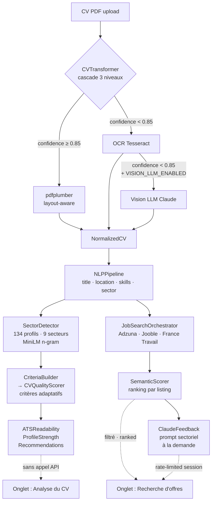

# ATS CV Scorer

Portfolio project — ML Engineer track (DataScientest).

🔗 **Live demo**: [voroman/ats-cv-scorer](https://huggingface.co/spaces/voroman/ats-cv-scorer)

Upload your CV (PDF) only. The pipeline extracts your profile, runs an
adaptive **ATS quality report** calibrated to your detected job sector,
searches matching listings across **3 sources**, and delivers a
**sector-aware Claude AI analysis** on demand per listing.

---

## Architecture

```
PDF
 │
 ▼
┌─────────────────────────────────────────────────────────────┐
│  CVTransformer — 3-level cascade                            │
│                                                             │
│  Level 1: pdfplumber (layout-aware)                         │
│    → detects 1-col / 2-col, reconstructs reading order      │
│    → confidence = min(1.0, word_count / 450)                │
│    → confidence ≥ 0.85 → stop                               │
│                                                             │
│  Level 2: Tesseract OCR                                     │
│    → only replaces pdfplumber if ocr_words > pdf_words×1.1  │
│       AND ocr_words ≥ 150                                   │
│    → confidence still < 0.85 → Level 3                      │
│                                                             │
│  Level 3: Vision LLM (Claude)                               │
│    → wins on structural richness score, not word count      │
│    → layout always taken from pdfplumber (real data)        │
│    → requires ANTHROPIC_API_KEY + VISION_LLM_ENABLED=true   │
└─────────────────────────┬───────────────────────────────────┘
                          │ NormalizedCV
                          ▼
┌─────────────────────────────────────────────────────────────┐
│  NLPPipeline                                                │
│    → job_title   (regex JOB_TITLE_KEYWORDS, 200+ titles)    │
│    → location    (postal code regex → filtered NER fallback) │
│    → postal_code (enables precise Adzuna geocoding)         │
│    → skills_flat (regex ALL_SKILLS_RE on raw_text)          │
│    → sector      (SECTOR_KEYWORDS scan on experience text)  │
└─────────────────────────┬───────────────────────────────────┘
                          │ NormalizedCV (enriched)
           ┌──────────────┴──────────────┐
           ▼                             ▼
┌──────────────────────┐    ┌────────────────────────────────────┐
│  SectorDetector      │    │  JobSearchOrchestrator             │
│                      │    │                                    │
│  134 SectorProfiles  │    │  Adzuna  — geo + multi-query       │
│  9 sectors           │    │  Jooble  — international           │
│  MiniLM cosine sim   │    │  France Travail — OAuth2, dept.    │
│                      │    │                                    │
│  score =             │    │  3 query variants per provider     │
│   0.4 × title_sim    │    │  (base title + synonym + ×sector)  │
│   0.35 × skills_kw   │    │  Parallel fan-out, URL dedup,      │
│   0.25 × exp_kw      │    │  graceful degradation              │
│                      │    └──────────────┬─────────────────────┘
│  n-gram windowing    │                   │ list[JobListing]
│  (noisy job_title)   │                   ▼
│  threshold: 0.30     │    ┌────────────────────────────────────┐
└──────────┬───────────┘    │  SemanticScorer (MiniLM)          │
           │ SectorDetectionResult  │  score per listing vs. CV         │
           ▼                │  keyword match + semantic sim      │
┌──────────────────────┐    │  + structure completeness         │
│  CriteriaBuilder     │    └──────────────┬─────────────────────┘
│  + CVQualityScorer   │                   │ list[RankedJobMatch]
│                      │                   ▼
│  per-profile criteria│    ┌────────────────────────────────────┐
│  (weight 0-100, req) │    │  ClaudeFeedback (on demand)       │
│                      │    │                                    │
│  ATSReadability      │    │  sector-aware prompt:             │
│  ProfileStrength     │    │  - profil détecté + confiance     │
│  Recommendations     │    │  - critères obligatoires KO       │
│  CriterionResult[]   │    │  - critères recommandés KO        │
└──────────┬───────────┘    │  3-part output: POINTS FORTS /   │
           │                │  POINTS À AMÉLIORER /             │
           ▼                │  CONSEIL PRIORITAIRE              │
  ┌────────────────┐        └───────────────────────────────────┘
  │ Onglet 1       │
  │ Analyse du CV  │        ┌───────────────────────────────────┐
  │                │        │ Onglet 2                          │
  │ · qualité ATS  │        │ Recherche d'offres                │
  │ · profil       │        │                                   │
  │ · secteur      │        │ · source status cards (real-time) │
  │ · critères     │        │ · ranked job cards (score+source) │
  │ · timeline     │        │ · source/salary filters           │
  │ · badges skills│        │ · Claude feedback per card        │
  └────────────────┘        └───────────────────────────────────┘
```

### Flux Mermaid



---

## Stack

| Couche | Technologie |
|---|---|
| Extraction PDF | pdfplumber (layout-aware) → Tesseract OCR → Vision LLM, cascade 3 niveaux |
| NLP | spaCy `en_core_web_sm` + regex (lexiques FR/EN) |
| Scoring sémantique | `sentence-transformers` `all-MiniLM-L6-v2` |
| Détection secteur | MiniLM cosine sim · 134 profils · 9 secteurs · n-gram title matching |
| Scoring ATS adaptatif | `CVQualityScorer` — critères pondérés par profil sectoriel |
| Feedback IA | Anthropic Claude (`claude-sonnet-4-6`) · prompt sectoriel · réponse FR |
| Recherche d'offres | `JobSearchOrchestrator` — Adzuna, Jooble, France Travail (OAuth2) |
| API REST | FastAPI `v0.3.0` — `/score`, `/find-jobs`, `/health` |
| UI | Gradio 4.44 — 2 onglets, thème Tech Dashboard custom |
| Déploiement | Hugging Face Spaces (Docker, Python 3.12) |

---

## Pipeline détaillé

### Onglet 1 — Analyse du CV

Déclenché à l'upload. Aucun appel réseau externe.

**1. Extraction — CVTransformer**

Cascade de confiance (confidence = `min(1.0, word_count / 450)`) :

- **Niveau 1 pdfplumber** : lit les positions caractère (`x0`, `top`, `size`, `fontname`), détecte le layout (gap central en x0 → 1 ou 2 colonnes), reconstruit l'ordre de lecture colonne gauche → droite, parse sections, header structuré (nom, titre, email, tél., localisation, code postal). Confiance ≥ 0.85 → fin.
- **Niveau 2 OCR Tesseract** : remplace pdfplumber seulement si `ocr_words > pdf_words × 1.10 AND ocr_words ≥ 150`.
- **Niveau 3 Vision LLM** : déclenché si confiance encore < 0.85, `ANTHROPIC_API_KEY` présent et quota session non épuisé. Gagne sur richesse structurelle (expériences, formations, projets, email, titre) — pas sur le word_count. Le layout est toujours pris sur les données pdfplumber réelles.

**2. NLP — NLPPipeline**

- `job_title` : regex `JOB_TITLE_KEYWORDS` (200+ métiers FR/EN) sur les premières lignes du header.
- `location` : code postal FR 5 chiffres + ville (regex `POSTAL_CODE_CITY_RE`) → fallback NER filtré avec `LOCATION_BLOCKLIST` (langues, mots génériques).
- `skills_flat` : regex pré-compilée `ALL_SKILLS_RE` sur `raw_text` (union des lexiques catégorisés ML / MLOps / Cloud / Data / Langages / Commerce / Autres).
- `sector` : scan `SECTOR_KEYWORDS` sur le texte des expériences (titre + company + bullets).

**3. Détection sectorielle — SectorDetector**

Score composite par profil :

```
score = 0.40 × title_sim + 0.35 × skills_kw + 0.25 × exp_kw
```

- `title_sim` : fenêtres n-gram (2–4 mots) sur `job_title` bruité → cosine sim max avec matrix d'aliases MiniLM précalculée.
- `skills_kw` : proportion de `detection_keywords` du profil trouvés dans `skills_flat + sections["skills"]`.
- `exp_kw` : proportion trouvée dans bullets d'expérience + `sections["experience"]`.
- Seuil de confiance : 0.30. En-dessous → profil générique `non_detecte`.
- Correction manuelle disponible via dropdown UI (override → `SectorDetector.make_forced_result()`).

**4. Scoring ATS adaptatif — CriteriaBuilder + CVQualityScorer**

Chaque `SectorProfile` définit une liste de `Criterion` (id, label, poids, required, fonction d'évaluation). `CriteriaBuilder` instancie les critères du profil détecté ; `CVQualityScorer` les évalue (score binaire 0/100 par critère, `weighted_score = score × weight / 100`) et produit :

- `ATSReadability` — layout, sections trouvées/manquantes, méthode d'extraction, machine-readable.
- `ProfileStrength` — score 0-100 (`Solide` ≥ 75 / `Correct` ≥ 50 / `À renforcer`), forces et améliorations.
- `list[Recommendation]` — ordonnées par priorité (1 Fort ATS-bloquant / 2 Moyen matching / 3 Faible polish).
- Timeline carrière — années d'expérience, année début, dernier poste, trous > 12 mois.

### Onglet 2 — Recherche d'offres

Réutilise le CV déjà parsé. Pas de re-traitement PDF.

**5. Sources d'offres — JobSearchOrchestrator**

| Provider | Couverture | Auth |
|---|---|---|
| **Adzuna** | FR natif | `ADZUNA_ID` + `ADZUNA_API_KEY` |
| **Jooble** | International | `JOOBLE_API_KEY` |
| **France Travail** | Pôle Emploi officiel | OAuth2 client credentials (`FRANCE_TRAVAIL_CLIENT_ID` / `_SECRET`) |

- Disponibilité vérifiée en parallèle (`ThreadPoolExecutor`) au chargement de l'onglet.
- 3 variantes de requête par source : titre de base + synonyme (`JOB_TITLE_SYNONYMS`) + titre × secteur.
- Géocodage : `"59170 Croix"` (code postal + ville) → Adzuna précis. Région manuelle prioritaire sur la localisation CV.
- Déduplication par URL, seuil qualité `_MIN_SCORE_THRESHOLD = 25.0`, signal `few_results` si < 3 offres.

**6. Scoring sémantique — SemanticScorer**

`overall_score = 0.40 × keyword_match + 0.35 × semantic_similarity + 0.25 × structure_completeness`

**7. Feedback Claude — ClaudeFeedback**

Prompt enrichi avec le contexte sectoriel :
- Profil détecté, confiance, critères obligatoires non satisfaits (label + evidence), critères recommandés non satisfaits.
- Instructions : 3 parties structurées (POINTS FORTS / POINTS À AMÉLIORER / CONSEIL PRIORITAIRE), max 250 mots, FR.
- Fallback générique si `sector_result=None`.

---

## API REST

`FastAPI v0.3.0` — démarrage : `make dev` → `http://localhost:8000/docs`

### `GET /health`

```json
{"status": "ok", "claude_budget_remaining": 297}
```

### `POST /score`

Champs form-data : `cv_file` (PDF), `job_description` (str), `include_feedback` (bool, défaut false).

Réponse `ATSResponse` :

```json
{
  "scoring_result": {"overall_score": 68.4, "breakdown": {...}, "missing_keywords": [...], "feedback": null},
  "parsed_cv": {"job_title": "Data Scientist", "skills_flat": [...], ...},
  "processing_time_seconds": 1.243,
  "detected_sector": "Informatique & Digital",
  "detected_profile": "data_scientist",
  "detection_confidence": 0.47,
  "criteria_results": [{"criterion_id": "eval_experience", "score": 100, "weighted_score": 20.0, ...}]
}
```

### `POST /find-jobs`

Champs : `cv_file` (PDF), `max_results` (int, défaut 20).  
Réponse : `list[RankedJobMatch]` (job + scoring_result, triés par score décroissant).

---

## Protections budget (démo live)

- **Session Vision LLM** : max 3 appels par session Gradio.
- **Session feedback Claude** : max 5 appels par session Gradio.
- **`VISION_LLM_ENABLED`** : désactivé par défaut (niveau 3 cascade off).
- **`CLAUDE_CALLS_LIMIT`** : quota global processus — une fois épuisé, le feedback IA est silencieusement désactivé sans casser l'extraction ni la recherche.

---

## UI — Tech Dashboard

Thème custom `gr.themes.Base` (indigo/slate, Inter + JetBrains Mono) + CSS injecté :

- **Metric cards** — 4 cards horizontales (Lisibilité ATS, Score profil, Mots-clés, Expérience) + badge méthode extraction.
- **Secteur détecté** — card avec profil, confiance, badges alternatives, dropdown correction manuelle.
- **Critères adaptatifs** — grille des critères du profil détecté (✅ / ❌, poids, evidence).
- **Skill badges** — compétences groupées par catégorie (ML / MLOps / Cloud / Data / Langages / Commerce).
- **Timeline HTML** — dots colorés (vert expérience, indigo formation, amber trou de carrière).
- **Job cards** — score en grand coloré par seuil (≥70 vert / ≥50 amber / <50 rouge) + pill source colorée.
- CSS dark mode : variables Gradio natives (`--body-text-color`, `--background-fill-*`, `--border-color-*`).

---

## Installation locale

```bash
cp .env.example .env
# Renseigner dans .env :
# ANTHROPIC_API_KEY, ADZUNA_ID, ADZUNA_API_KEY
# (optionnel) JOOBLE_API_KEY
# (optionnel) FRANCE_TRAVAIL_CLIENT_ID, FRANCE_TRAVAIL_CLIENT_SECRET
# (optionnel) VISION_LLM_ENABLED=true

make install        # dépendances runtime
make install-dev    # + pytest, fpdf2, reportlab (tests + benchmark)
make run            # UI Gradio → http://localhost:7860
make dev            # API FastAPI → http://localhost:8000/docs
make test           # 376 tests, 10 skippés (PDFs privés)
make benchmark-sectoriel  # rapport CSV détection × scoring par CV
make update-lexicons      # régénère lexicons_generated.json (voir ci-dessous)
```

OCR (niveau 2) requiert : `tesseract-ocr`, `tesseract-ocr-fra`, `poppler-utils`
(pré-installés sur l'image HF Spaces via `packages.txt`).

## Mise à jour des lexiques ESCO

```bash
make update-lexicons
```

Déclenche `LexiconBuilder.build(force_refresh=True)` :
1. Interroge l'API ESCO (Union Européenne) pour les compétences numériques et transversales.
2. Fusionne avec les lexiques sectoriels du projet (`SKILL_CATEGORIES`, `SECTOR_KEYWORDS`).
3. Régénère `src/core/lexicons_generated.json` (commit le fichier pour propager les mises à jour).
4. Relancer l'app (`make run`) pour que `init_lexicons()` charge le nouveau fichier.

La commande est idempotente — sans `--force`, elle ne requête pas l'API si le fichier existe et date de moins de 7 jours.
